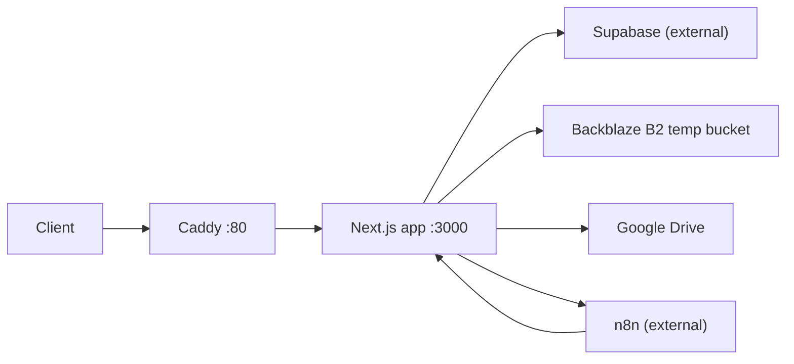

# Docker production deployment

Production deployment target: **Ubuntu 26.04 VPS** with Docker Engine + Docker Compose.

| Path | Purpose |
|---|---|
| `/opt/ai-factory/app` | Git clone of `battlestartvr-factory/video-factory` |
| `/opt/ai-factory/.env` | Production secrets (not in Git) |
| `/srv/ai-factory` | Persistent/scratch data volume mounted into the app container |

Vercel deployment remains unchanged until URL cutover is explicitly approved.

## Quick start (VPS)

```bash
sudo install -d -m 755 /opt/ai-factory /srv/ai-factory
sudo git clone https://github.com/battlestartvr-factory/video-factory.git /opt/ai-factory/app
sudo cp /opt/ai-factory/app/deploy/env.production.example /opt/ai-factory/.env
# edit /opt/ai-factory/.env with real values
sudo chmod 640 /opt/ai-factory/.env

cd /opt/ai-factory/app
./scripts/deploy.sh
```

Site is served on **port 80** via Caddy → Next.js `0.0.0.0:3000`.

## Architecture



## Files added for Docker deployment

| File | Purpose |
|---|---|
| `Dockerfile` | Multi-stage production build (Node 22, standalone output, ffmpeg) |
| `.dockerignore` | Keeps secrets, tests, and dev artifacts out of build context |
| `docker-compose.yml` | `app` + `caddy` services, healthchecks, data volume |
| `deploy/Caddyfile` | Reverse proxy on `:80`, SSE/long-timeout tuning |
| `deploy/env.production.example` | VPS env template |
| `scripts/deploy.sh` | Fetch → checkout → build → up → health wait |
| `.github/workflows/deploy-production.yml` | SSH deploy on push to `main` |
| `next.config.ts` | `output: "standalone"` for Docker |

## Required production environment variables

See `deploy/env.production.example` and `docs/environment-inventory.md`.

### REQUIRED NOW

| Variable | Notes |
|---|---|
| `NEXT_PUBLIC_SUPABASE_URL` | Build-time + runtime (public) |
| `NEXT_PUBLIC_SUPABASE_ANON_KEY` | Build-time + runtime (public) |
| `SUPABASE_SERVICE_ROLE_KEY` | Runtime secret |
| `KIE_API_KEY` | Runtime secret |
| `APP_URL` | Set to `http://<VPS_IP>` until domain cutover |
| `B2_*` + `INGEST_PROXY_TOKEN` | When asset ingest is used |

### OPTIONAL

Google Drive, web search, n8n/factory, `LOG_LEVEL`, deprecated `AGENT_LLM_*`.

## Variables currently set only on Vercel

There is **no Vercel-specific env naming** in code. The same canonical set from `.env.example` / `docs/deployment.md` is expected on the VPS. Vercel typically holds:

- All Supabase keys
- `KIE_API_KEY`, `APP_URL` (currently the `*.vercel.app` URL)
- Google Drive credentials
- n8n webhook URLs/secrets
- B2/R2 ingest credentials
- `INGEST_PROXY_TOKEN`
- Optional web search keys

Copy these from the Vercel project dashboard into `/opt/ai-factory/.env`, updating `APP_URL` to the VPS IP (or future domain).

## URLs / callbacks to update after cutover

Do **not** change these until production traffic moves off Vercel:

| Consumer | Current (Vercel) | After VPS cutover |
|---|---|---|
| `APP_URL` env | `https://*.vercel.app` | `http://<VPS_IP>` then `https://<domain>` |
| n8n job callbacks | `{APP_URL}/api/webhooks/n8n/job-update` | Same path on new host |
| n8n asset ingest | `{APP_URL}/api/internal/asset-ingest` | Same path on new host |
| Supabase Auth redirect URLs | Vercel URL in Supabase dashboard | Add VPS IP/domain to allowed redirect URLs |
| Supabase Site URL | Vercel URL | Update when cutover confirmed |
| Google OAuth (if used) | Vercel authorized origins | Add VPS domain |
| External health checks | `GET /api/health` on Vercel | Same on VPS `:80` |

## Remaining Vercel dependencies in the project

| Location | Dependency | Action |
|---|---|---|
| `package.json` | None — no `@vercel/*` packages | None |
| Application code | None — no `VERCEL_*` env reads | None |
| `docs/deployment.md` | Documents Vercel setup | Keep until cutover |
| `docs/n8n-contract.md` | Example URLs use `vercel.app` | Update examples at cutover |
| `docs/architecture.md` | Describes Vercel topology | Update at cutover |
| `.gitignore` | Ignores `.vercel/` | Keep |
| Vercel project (external) | Live production | **Do not delete** per migration plan |

## Upload limits & streaming (Docker/Caddy verified)

| Endpoint | Limit / behavior | Docker impact |
|---|---|---|
| `POST /api/internal/asset-ingest` | `maxDuration=300`, downloads up to 25 MiB images / 250 MiB video, streams to B2 | Caddy `read_timeout`/`write_timeout` 6m; no body upload (JSON only) |
| `PATCH /api/knowledge/upload` | 15 MiB server upload | Caddy `request_body max_size 20MB`; Next middleware body 16 MiB |
| `POST /api/chats/.../messages?stream=1` | SSE streaming | Caddy `flush_interval -1` |
| Next.js middleware | `middlewareClientMaxBodySize: 16mb` | Unchanged in container |

No FFmpeg calls exist in application code today; the production image includes `ffmpeg` for future in-container media utilities.

## GitHub Actions production deploy

Workflow: `.github/workflows/deploy-production.yml` (push to `main`).

**Secrets** (repository → Settings → Secrets → Actions):

| Secret | Description |
|---|---|
| `DEPLOY_HOST` | VPS IP or hostname |
| `DEPLOY_USER` | SSH deploy user |
| `DEPLOY_SSH_KEY` | Private key for deploy user |

No third-party Actions are used for deploy (native `ssh` only).

**VPS prerequisites for deploy user:**

```bash
# deploy user can run docker and read env
sudo usermod -aG docker deploy
sudo chown root:deploy /opt/ai-factory/.env
sudo chmod 640 /opt/ai-factory/.env
```

## Health checks

- `GET /api/health` — lightweight JSON, no external calls
- `HEAD /api/health` — 200 for probes
- Docker `HEALTHCHECK` on app container
- `scripts/deploy.sh` waits for Docker health + HTTP probe

## Supabase Auth

Auth uses cookie-based `@supabase/ssr` middleware. No schema changes required. Before cutover, add the VPS URL to Supabase **Redirect URLs** and **Site URL** when ready.

## Rollback

```bash
cd /opt/ai-factory/app
git checkout <previous-sha>
./scripts/deploy.sh <previous-sha>
```

Vercel remains the fallback production URL until cutover.
